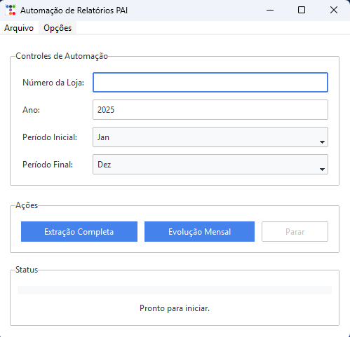

# Automação de Relatórios PAI

Este projeto consiste numa aplicação de desktop desenvolvida em Python para automatizar o download e processamento de relatórios financeiros e de performance do sistema PAI da Febrafar. A aplicação possui uma interface gráfica para facilitar a interação do usuário.



## ✨ Funcionalidades

-   **Automação Completa:** Baixa todos os relatórios (Financeiro e Performance) para uma ou mais lojas num período especificado e processa os dados, inserindo-os na base de dados.
-   **Evolução Mensal:** Baixa especificamente os relatórios de evolução mensal e processa-os.
-   **Busca de Lojas:** Permite buscar todas as lojas que tiveram lançamentos num determinado ano, exibindo a quantidade de meses com dados.
-   **Execução em Lote:** Permite selecionar múltiplas lojas a partir da busca e executar a automação completa para todas de uma só vez.
-   **Interface Gráfica:** Interface amigável construída com `ttkbootstrap` para uma experiência de usuário moderna.

## 🚀 Começando

Siga estas instruções para configurar e executar o projeto no seu ambiente.

### Pré-requisitos

-   [Python](https://www.python.org/downloads/) (versão 3.10 ou superior)
-   [Git](https://git-scm.com/downloads/)

### 1. Clonando o Repositório

Primeiro, clone o repositório para a sua máquina local usando o seguinte comando no terminal:

```bash
git clone <URL_DO_SEU_REPOSITORIO>
cd Automacao_PAI
```

### 2. Configurando o Ambiente Virtual

É uma boa prática usar um ambiente virtual para isolar as dependências do projeto.

```bash
# Criar o ambiente virtual
python -m venv venv

# Ativar o ambiente virtual
# No Windows:
.\venv\Scripts\activate
# No macOS/Linux:
source venv/bin/activate
```

### 3. Instalando as Dependências

Com o ambiente virtual ativado, instale todas as bibliotecas necessárias com um único comando:

```bash
pip install -r requirements.txt
```

### 4. Configurando as Credenciais

Para que a aplicação funcione, é necessário fornecer as credenciais de acesso.

1.  Encontre o ficheiro `config.json.example` na raiz do projeto. Ele serve como um modelo.
2.  Crie uma cópia deste ficheiro na mesma pasta e renomeie-a para `config.json`.
3.  Abra o `config.json` e preencha com as suas credenciais reais. O ficheiro deve ficar assim:

    ```json
    {
      "login": {
        "usuario": "seu_email@dominio.com",
        "senha": "sua_senha_do_pai"
      },
      "database": {
        "user": "seu_usuario_do_banco",
        "password": "sua_senha_do_banco",
        "host": "ip_do_banco",
        "port": 3306,
        "database": "nome_do_banco"
      }
    }
    ```
> **IMPORTANTE:** O ficheiro `config.json` está listado no `.gitignore`, pelo que as suas credenciais nunca serão enviadas para o repositório, garantindo a segurança.

## ▶️ Como Executar

Com o ambiente virtual ativado e as credenciais configuradas, execute o seguinte comando na raiz do projeto para iniciar a aplicação:

```bash
python main.py
```

## 📦 Gerando um Executável (Opcional)

Pode compilar a aplicação num executável (`.exe`) para facilitar a distribuição.

1.  **Ícone:** Certifique-se de que o ícone `icone.ico` está dentro da pasta `assets/`.
2.  **Execute o PyInstaller:** No terminal (com o ambiente virtual ativado), execute o comando:

    ```bash
    pyinstaller --name "Automacao PAI" --windowed --icon="assets/icone.ico" --add-data "config.json:." --add-data "assets:assets" main.py
    ```

3.  **Encontre o Executável:** Após a compilação, uma nova pasta `dist` será criada. Dentro dela, encontrará a pasta `Automacao PAI`. O seu programa pronto para uso é o `Automacao PAI.exe` que está dentro desta pasta. Para partilhar, basta compactar a pasta `Automacao PAI` inteira e enviá-la.

## 📂 Estrutura do Projeto

A estrutura de pastas foi organizada para separar as responsabilidades:

```bash
    ├── assets/             # Recursos estáticos, como o ícone da aplicação.
    ├── controller/         # Orquestra a lógica da aplicação (workflows).
    ├── processing/         # Módulos para processar os dados dos arquivos Excel.
    ├── scraping/           # Módulos para automação web com Selenium.
    ├── utils/              # Funções de utilidade (conexão com DB, config, etc.).
    ├── view/               # Módulos da interface gráfica (GUI).
    ├── config.json.example # Arquivo de exemplo para as credenciais.
    ├── main.py             # Ponto de entrada da aplicação.
    └── requirements.txt    # Lista de dependências Python.
```